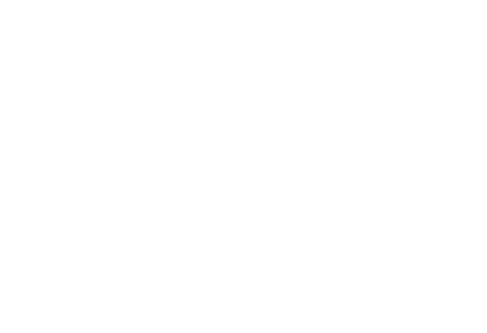
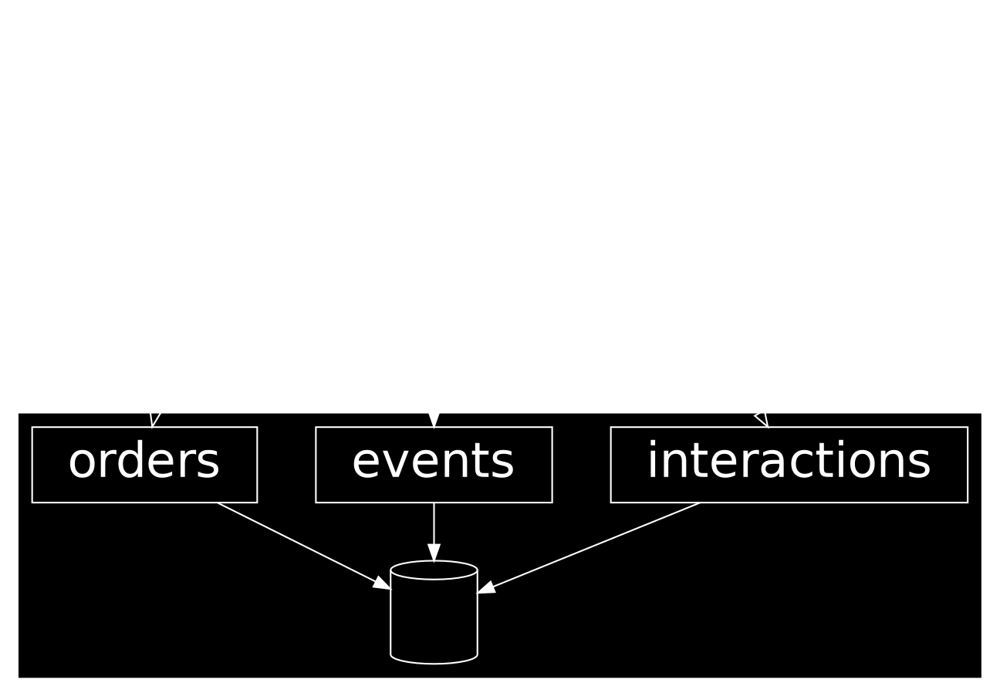
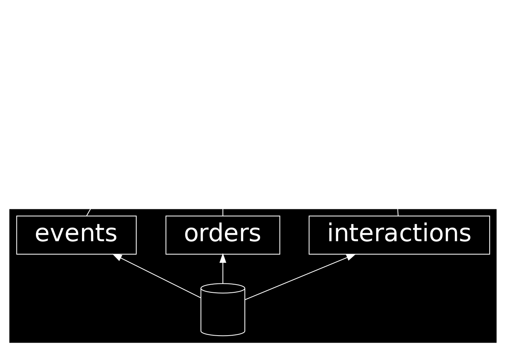

---
presentation:
  # presentation theme
  # === available themes ===
  # "beige.css"
  # "black.css"
  # "blood.css"
  # "league.css"
  # "moon.css"
  # "night.css"
  # "serif.css"
  # "simple.css"
  # "sky.css"
  # "solarized.css"
  # "white.css"
  # "none.css"
  theme: black.css
---

<!-- slide -->

# Rails Meetup 2022

Hoelzle AG
Gregor Wassmann

<!-- slide -->

<!-- slide -->

<!-- slide -->

<!-- slide -->

We’re a team of four Ruby on Rails developers rethinking and migrating a legacy ERP system.

Franco Sebregondi
Aleixis Reigel
Yves Senn
Gregor Wassmann

<!-- slide -->

Please find slides and source code on
[github.com/gregorw/discriminable](https://github.com/gregorw/discriminable)

<!-- slide -->

# Discriminable

[github.com/gregorw/discriminable](https://github.com/gregorw/discriminable)

The why and how of STI

Bonus: Experience creating a gem.

<!-- slide -->

# Data Modeling

<!-- slide -->

## ORM

<!-- slide -->

## Multitable inheritence MTI

<!-- slide -->

## Multitable inheritence MTI2

<!-- slide -->

## Rails STI

| *value* | string | integer | boolean | enum | … |
|--|--|--|--|--|--|
| single | 🟡 `class.name` only | 🔴 |  🔴 |  🔴 |  🔴 |
| multiple | 🔴 | 🔴 |  🔴 |  🔴 |  🔴 |

<!-- slide -->

## Discriminable Gem

| *value* | string | integer | boolean | enum | … |
|--|--|--|--|--|--|
| single | 🟢 | 🟢 |  🟢 |  🟢 |  🟢 |
| multiple | 🟢 | 🟢 |  🟢 |  🟢 |  🟢 |

<!-- slide -->

## Pros

- Useable with existing data (model)
- More flexibility
- Support for multiple values
- Refactor class names without the need for a data migration (loose coupling)

<!-- slide -->

There is no right or wrong.
Be pragmatic.

<!-- slide -->

Questions?

<!-- slide -->

Thanks

<!-- slide -->

# Agenda

- Data Modelling
- Rails STI
- Limitations
- Related work / Java
- How to release a gem?
