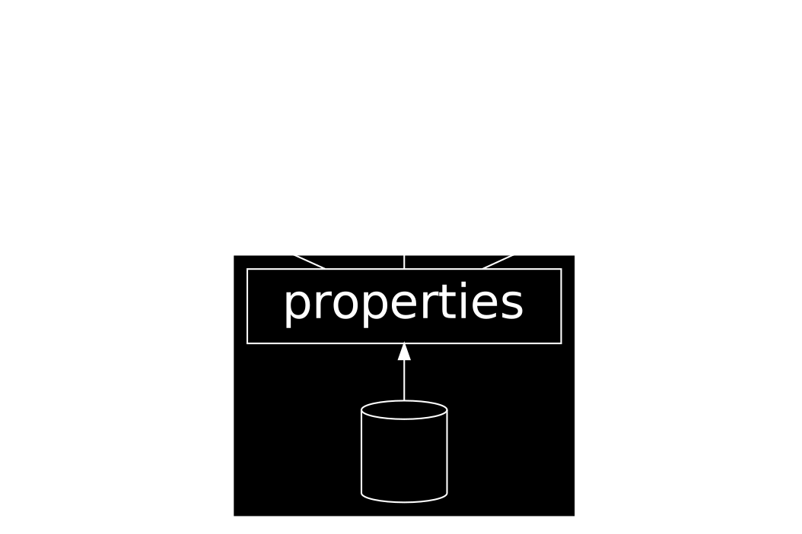
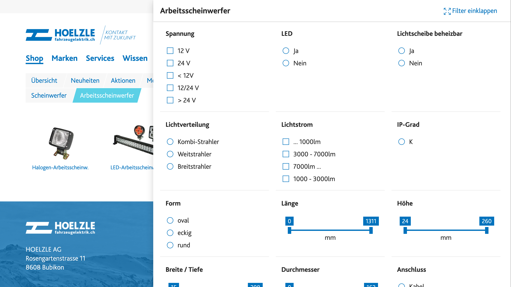
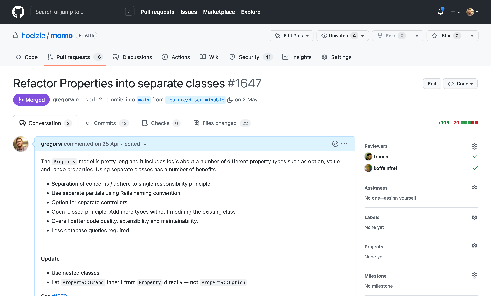
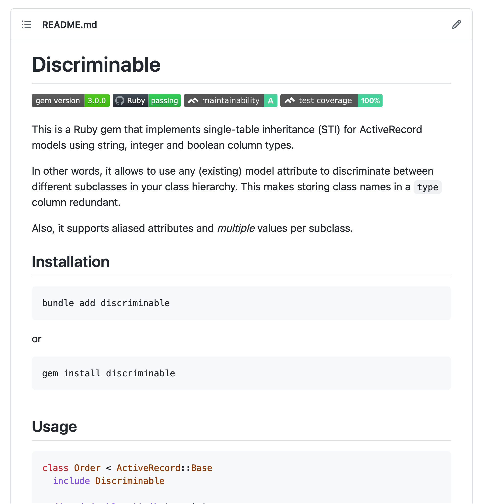

---
presentation:
  # presentation theme
  # === available themes ===
  # "beige.css"
  # "black.css"
  # "blood.css"
  # "league.css"
  # "moon.css"
  # "night.css"
  # "serif.css"
  # "simple.css"
  # "sky.css"
  # "solarized.css"
  # "white.css"
  # "none.css"
  theme: black.css
---

<!-- slide -->

# Rails Meetup 2022

Hoelzle AG
Gregor Wassmann

<!-- slide -->


<!-- slide -->


<!-- slide -->


<!-- slide -->


<!-- slide -->

We’re a team of four Ruby on Rails developers rethinking and migrating a legacy ERP system.


<!-- slide -->

Please find slides and source code on
[github.com/gregorw/discriminable/tree/demo](https://github.com/gregorw/discriminable/tree/demo)


<!-- slide -->

# Discriminable

[github.com/gregorw/discriminable](https://github.com/gregorw/discriminable)

More powerful STI

<!-- slide -->

**Single-table inheritance** means using different classes for the same database table.

A **discriminator** figures out the class from a record based on some attribute value.

<!-- slide -->



<!-- slide -->

# Motivation

<!-- slide -->



<!-- slide -->

## A

```ruby
class Order
  enum state: { open: 1, completed: 2 }
end
```

## B

```ruby
class Cart < Order
end
```

<!-- slide -->



<!-- slide -->


```ruby
class Property < ApplicationRecord
  include Discriminable

  discriminable_attribute :kind
end

class Property::Number < Property
  discriminable_value 1
end

class Property::Option < Property
  discriminable_values 2, 3, 4 # The first mention becomes the default value
end
```

<!-- slide -->

## Benefits of separate classes

- Separation of concerns / adhere to **single responsibility principle**
- Use separate partials using Rails naming convention
- Option for separate controllers
- **Open-closed principle**: Add more types without modifing the existing class
- Overall better code quality, extensibility and maintainability
- **Less database queries** required


<!-- slide -->

## Rails STI

| *value* | string | integer | boolean | enum | … |
|--|--|--|--|--|--|
| single | 🟡 `class.name` only | 🔴 |  🔴 |  🔴 |  🔴 |
| multiple | 🔴 | 🔴 |  🔴 |  🔴 |  🔴 |

<!-- slide -->

## Discriminable Gem

| *value* | string | integer | boolean | enum | … |
|--|--|--|--|--|--|
| single | 🟢 | 🟢 |  🟢 |  🟢 |  🟢 |
| multiple | 🟢 | 🟢 |  🟢 |  🟢 |  🟢 |

<!-- slide -->

## Why discriminable?

- Useable with existing data (model)
- More flexibility
- Support for multiple values
- Refactor class names without the need for a data migration (loose coupling)
- 70 lines of code

<!-- slide -->




<!-- slide -->

## Experience of writing a Gem

- Great ecosystem (Rubygems, Bundler, Github Actions, etc.)
- Learning happens outside your comfort zone (Minitest, Github Matrix, Rails source code)
- Rails can (and should) learn from Java and Python, too

<!-- slide -->

## Hash memoization

```ruby
Hash.new do |map, value|
  map[value] = value.constantize._discriminable_values&.first
end
```

<!-- slide -->

I hope `discriminable` will be useful to *you*.

<!-- slide -->

Questions?

<!-- slide -->

Thanks
